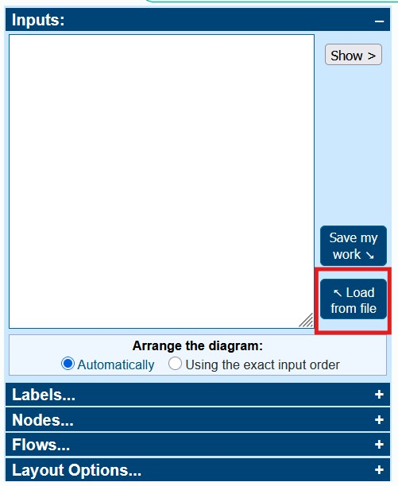

## Sankey Cost Data Generator

### 🎯 Purpose

This repository contains scripts designed to process raw cloud cost data from a CSV file and generate flow data formatted specifically for use with **SankeyMATIC** (a Sankey diagram visualization tool).

The scripts apply specific business logic to simplify and categorize the data, making complex cost flows easier to visualize and analyze.

#### Cost Flow Logic

The scripts generate flows across four levels:
1. **PricingModel** (`SavingsPlan`, `Reservation`, `OnDemand`)
2. **MeterCategory** (Grouped)
3. **TotalMonthly** (A central sink/source node)
4. **Environment** (`Live`, `Non-Live`, `SAP`, etc.)

Flows are structured as: `PricingModel -> MeterCategory (Grouped) -> TotalMonthly -> Environment`.

---

### 🎯 Usage
Once the output file is generated, it can be loaded via "**Load from file**" option on the [sankeymatic](https://sankeymatic.com/build/) page.


---


### ⚙️ Core Rules

The scripts enforce the following grouping and naming rules for the **MeterCategory** level:
- **ETL Combination:** `Azure Data Factory v2` and `Azure Synapse Analytics` are combined into a single category named `ETL Tools`.
- **Reservation Mandate:** Any category that has a `Reservation` pricing model is **never** grouped into `Others`. These categories are always displayed separately.
- **Top Categories:** The script ensures the **total number of categories** displayed in the middle column (including 'Others') matches the value set by the `TopCategories` parameter.
- **Sorting:** All levels (except `PricingModel`) are sorted by total cost in **descending order** for better flow visualization.


---

### 💾 Required Input File: The CSV

The script requires a CSV file as input (e.g., `Month2025-10.csv`). This file must contain the following minimum column headers:

| **Header** | **Description** |
| --- | --- |
| `PricingModel` | e.g., OnDemand, Reservation, SavingsPlan |
| `MeterCategory` | The specific service category (e.g., Virtual Machines, SQL Database) |
| `Environment` | The deployment environment (e.g., Live, Non-Live, SharedServices) |
| `Monthy Cost` | The cost value. (Commas (`,`) are automatically removed, and values are rounded to integers.) |

---

### 🛠 PowerShell Script Parameters

The PowerShell script's parameters are:

| **Parameter** | **Type** | **Required** | **Default** | **Description** |
| --- | --- | --- | --- | --- |
| `-csvFile` | String | **Yes** | N/A | The path to the source cost data CSV file. |
| `-TopCategories` | Integer | No | `9` | The **total number of categories** to display in the middle column, including the calculated `Others` category. |
| `-OverwriteJsonFile` | String | No | N/A | Path to an external JSON file for custom label remapping. Overrides hardcoded defaults. |
| `-Formatted` | Switch | No | False | If set, the output is saved into `sankeymatic_template.txt` and the timestamp is updated. Output file name is `sankeymatic_YYYYmmDD-HHMMSS.txt`. |
| `-Screen` | Switch | No | False | If set, the generated Sankey flow data is written directly to the console output. |


---

### 🐍 Python Script Implementation

The logic is also available as a Python script (e.g., `sankey_generator.py`) for cross-platform execution.

#### Requirements

The Python script requires the `pandas` library. 
To install dependencies:

```shell
pip install pandas
```
 

#### Python Script Parameters

The parameters are functionally identical to the PowerShell script.

| **Argument** | **Type** | **Required** | **Default** | **Description** |
| --- | --- | --- | --- | --- |
| `--csvFile` | String | **Yes** | N/A | Path to the source cost data CSV file. |
| `--TopCategories` | Integer | No | `9` | The **total number of categories** to display (including 'Others'). |
| `--OverwriteJsonFile` | String | No | `None` | Path to the external JSON file for label remapping. |
| `--Formatted` | Flag | No | False | If included, outputs the data to the template file (`sankeymatic_template.txt`). |
| `--Screen` | Flag | No | False | If included, prints the generated data to the console. |


Example Usage (Python): 

```shell
python sankey_generator.py --csvFile Month2025-10.csv --TopCategories 10 --Screen --Formatted`
```

---
 

### 📄 Supporting Files

#### 1. `sankeymatic_template.txt`

This file is required when the `-Formatted`flag is used with either the PowerShell or Python scripts. It contains the structure and settings for your SankeyMATIC diagram.
 

**Key Requirements for Content Injection:**
- The data insertion point:
    `// === Nodes and Flows ===`
- The timestamp placeholder:
    `// SankeyMATIC diagram inputs - Saved: %GENERATED DATETIME%`


#### 2. `overwrite_map.json` (Optional)
This file is used with the `OverwriteJsonFile` parameter to rename categories for cleaner visualization. 

**Structure:** A simple Key-Value JSON object where the **Key** is the original category name and the **Value** is the desired label. 

    Reminder: Standard JSON does not support comments (// or /* */).

Example JSON Structure:

```json
{
  "Azure Database for PostgreSQL": "PostgreSQL",
  "Azure Cognitive Search": "Azure Search"
}
```
